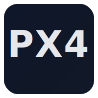

<h1>Hi 👋, I'm  Pouya</h1>

AI & Robotics Developer

<h2>Languages and Tools I Use</h2>

<h2> Stats Dashboard</h2>

  
  

<h2>Recent Documentations</h2>
<ul>
<li><a target="_blank" href="https://pouya-shaterzadeh.github.io/docs/ur_reach_migration/">ROS 2 Humble to Jazzy Migration Guide for IsaacLab UR Reach</a></li>
<li><a target="_blank" href="https://pouya-shaterzadeh.github.io/docs/opencv_migration/">OpenCV Gazebo ROS 1 to ROS 2 Migration</a></li>
</ul>
<h2>Where to find me</h2>

